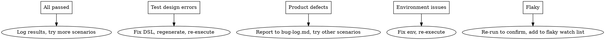

# E2E Testing Workflow for AI Web Testing Platform

## Overview

This skill guides Claude through the complete E2E testing chain of this platform: **AI Conversation → Element Scoring → Save & Execute → Test Report → Data Loop Feedback**, with Claude acting as a **real user** providing feedback to the AI planning agent.

The platform uses a **dual-layer locator scoring** system:
- **Generation-time**: PreScorer scores DOM candidates during page exploration
- **Runtime**: RuntimeScorer supplements with actionability/visual/history features
- **Postcondition**: Verifies state changes after each action
- **Data loop**: Every attempt logged to `LocatorAttemptLog` for model evolution

## Prerequisites

Before starting, verify the environment:

```bash
# Backend: check dependencies and migrations
cd backend && uv sync && uv run alembic upgrade head

# Frontend: check dependencies
cd frontend && npm install
```

Required env vars in `backend/.env`:
- `LLM_API_KEY` — LLM provider API key for AI planning
- `LLM_BASE_URL` — LLM API endpoint
- `LLM_MODEL` — Model name (e.g. `glm-4-flash`)

## Phase 1 — Start the System

### 1.1 Start Backend

```bash
cd backend && uv run backend-dev
```

Verify: `curl http://127.0.0.1:8000/api/v1/health` returns `{"status": "ok"}`

### 1.2 Start Frontend

```bash
cd frontend && npm run dev
```

Verify: Open `http://127.0.0.1:5173` in browser

### 1.3 Prepare Target App

Prepare a **target web application** to test against. Common options:
- Local dev server of the system under test
- Public demo site (e.g. `https://the-internet.herokuapp.com`)
- The platform itself (self-testing)

Record the **base_url** — it will be needed in the AI conversation.

## Phase 2 — AI Planning Conversation

### 2.1 Enter Planning Page

1. Open `http://127.0.0.1:5173` in browser
2. Navigate to the **Planning** page (left sidebar)
3. Select a project from the project dropdown
4. A new AI planning session starts automatically

### 2.2 Act as Real User — Conversation Pattern

When testing the AI conversation flow, Claude acts as a **real QA engineer**. Follow this conversation pattern:

**First message — Describe the testing goal:**
> "我要测试 [目标系统名] 的 [功能模块]。系统地址是 [base_url]。主要业务流程是 [简述核心流程]。"

**Example:**
> "我要测试一个登录功能。系统地址是 http://the-internet.herokuapp.com。主要流程是输入用户名密码然后点击登录按钮，验证登录成功。"

**Subsequent messages — Provide details when AI asks:**

AI will collect 7 information slots through conversation:
1. **被测系统** — Target system name and URL
2. **业务目标** — What business scenario to test
3. **入口页面** — Starting page URL
4. **核心流程** — Key user workflow steps
5. **关键断言** — What to verify at each step
6. **测试数据** — Input data (usernames, passwords, etc.)
7. **范围限制** — Any constraints or exclusions

**Respond naturally** to AI questions. Do NOT dump all information at once — simulate how a real user would interact.

### 2.3 Verify AI Planning Quality

After AI generates a test plan (test scenarios), check:

| Check Point | What to Verify |
|---|---|
| Scenario completeness | Does it cover the described business flow? |
| Scenario accuracy | Are the described steps correct for the target app? |
| Missing scenarios | Are obvious edge cases missed? |
| Data requirements | Are test data needs identified? |
| Key assertions | Are verification points correct? |
| Element exploration | Did AI successfully explore the page and collect elements with scored candidates? |

If the AI's exploration failed (no page elements collected), it should report this. The PreScorer automatically scores each element's locator candidates during exploration.

### 2.4 Provide User Feedback

As a real user, provide feedback:

- **If plan is good**: Select scenarios and proceed to DSL generation
- **If plan has issues**: Point out what's wrong or missing
  > "方案遗漏了登录失败的边界场景，请补充。"
- **If AI misunderstood**: Correct the understanding
  > "不是这样的，登录页面有两个输入框和一个提交按钮，不是下拉选择。"

## Phase 3 — Generate, Save & Execute DSL

### 3.1 Generate DSL Drafts

1. After reviewing the test plan, click **"生成 DSL"** for selected scenarios
2. AI generates DSL test case drafts based on the scenario descriptions
3. Each draft contains structured steps: `goto`, `click`, `input`, `wait_for`, `assert_text`, `assert_url_contains`

### 3.2 Verify DSL Quality

Check each generated DSL draft:

| Check Point | What to Verify |
|---|---|
| Step order | Do steps follow logical business flow? |
| **Candidates** | Do interactive steps have `candidates` with scored locator strategies? |
| **VLM fallback** | Is a VLM candidate (`strategy="vlm"`) included as last fallback? |
| **Postconditions** | Are postconditions inferred for interactive steps? (url_changes, text_visible, etc.) |
| Locators | Are element targets reasonable? (role, text, CSS, data-testid) |
| Actions | Are action types correct for each step? |
| Assertions | Do verification steps exist and target correct elements? |
| Base URL | Is the target URL correct? |
| Input contract | Are variable inputs properly defined? |

**Candidate scoring check**: For each interactive step, the top candidate should have `pre_score > 0.5`. If all candidates have low scores (< 0.3), the AI may have failed to find good locators — consider providing more specific element descriptions.

### 3.3 Save & Execute

1. Select satisfactory drafts
2. Click **"保存并执行"** (Save and Execute)
3. System saves DSL as test cases and triggers Playwright execution
4. **For Explorer-Judge mode**: Click **"执行并分析"** if available — runs Explorer (non-terminating) then Judge (AI analysis)

### 3.4 Monitor Execution

During execution, observe real-time progress:
- Step-by-step status updates via SSE streaming
- **Dual-layer scoring decisions**: which candidate was selected, what strategy was chosen (dom_action / vlm_rerank / vlm_grounding)
- **Postcondition verification results**: which postconditions passed/failed
- Screenshots captured at each step
- Locator resolution traces with pre_score and final_score
- Console errors and network events

If execution gets stuck or takes too long (>2 minutes), investigate.

**Scoring decision check**: If a step falls back to VLM grounding when it should have used DOM, the pre_score may be too low — check the candidate quality. If a step uses DOM action but the click fails, check if postcondition verification caught it.

## Phase 4 — Analyze Test Report

### 4.1 Review Execution Detail

After execution completes, review the **Execution Detail Page**:

**Left panel — Step timeline:**
- Green = passed, Red = failed, Yellow = cascade_blocked
- Click each step for details

**Center panel — Step evidence:**
- Page info (URL, title, viewport)
- Locator info (candidates, resolution strategy, failure reason)
- **Scoring trace**: pre_score → runtime_score → final_score → strategy decision
- **Postcondition results**: which conditions passed/failed
- Screenshot evidence
- Console/network events

**Right panel — Statistics:**
- Execution overview card
- Locator strategy distribution (DOM vs VLM vs rerank)
- Candidate element list with scores

### 4.2 Evaluate Scoring Quality

After each execution run, assess the dual-layer scoring system:

| Check Point | What to Verify |
|---|---|
| DOM priority | Did high-score DOM candidates succeed without VLM? |
| VLM fallback | Did VLM correctly rescue failed DOM candidates? |
| False confidence | Did any high-score candidate actually fail? (scoring model may need calibration) |
| Postcondition accuracy | Did postconditions correctly detect successes and failures? |
| Overlay recovery | Did click_preprocessor successfully handle overlays? |
| Strategy distribution | Is the DOM/VLM ratio reasonable? (>70% DOM is healthy) |

### 4.3 Judge Failure Classification Accuracy

Evaluate if the AI correctly classified failures:

- **test_design_error**: DSL has wrong selectors, missing steps, incorrect assertions
- **automation_issue**: Timing issues, locator fragility, environment mismatch
- **product_defect**: Actual bug in the target application
- **environment**: Network errors, server down, page load failures
- **suspected_flaky**: Intermittent failures without clear pattern

## Phase 5 — Iterate and Feedback

### 5.1 Based on Results, Choose Next Action



### 5.2 Provide Feedback to AI

Return to the planning conversation and share results:

> "执行完了，3个用例通过，2个失败。失败原因是 [具体原因]。请帮我调整测试方案。"

Include scoring-specific feedback when relevant:

> "购物车页面的按钮定位成功率低，pre_score 只有 0.3，应该用 role 定位而不是 CSS class。"

The AI should then:
- Analyze failure patterns (using execution analysis tools)
- Suggest DSL corrections
- Recommend regression scope
- Reference `LocatorAttemptLog` data to identify recurring locator failures

### 5.3 Verify AI Response to Feedback

Check that the AI agent:
- Uses `get_execution_detail` / `get_failure_analysis` tools to investigate
- Provides actionable corrections, not generic advice
- Updates test plan based on execution evidence
- Doesn't repeat the same failed approach without changes
- Adjusts candidate strategies based on previous failures (data loop)

### 5.4 Data Loop Check

After multiple execution rounds, verify the data loop is functioning:

| Check Point | What to Verify |
|---|---|
| LocatorAttemptLog records | Are attempts being logged with full scoring trace? |
| Historical patterns | Does AI reference previous locator failures? |
| Score calibration | Are scoring thresholds adjusting based on real data? |
| Selector improvement | Are better selectors being chosen in subsequent runs? |

## Phase 6 — Verify New Architecture Features (v2026-05-03)

After the enterprise middleware upgrade, these additional checks apply:

### 6.1 Action-Driven explore_flow

Verify the new `steps` parameter works correctly in `explore_flow`:

| Check Point | What to Verify |
|---|---|
| Steps format | AI can call `explore_flow` with `steps: [{url, description, actions: [{action, target, value}]}]` |
| Actions execute | Click/input/wait_for actions actually execute between page visits |
| Action fallback | If a click target doesn't match, the locator chain falls through (label → role → text → id) — no silent failure |
| Backward compat | `explore_flow({urls: [...]})` still works without `steps` |
| Login flow | Flow like "home → click Login → input email/password → click Submit → collect dashboard" produces elements from all states |

**Test command to verify action execution:**
```bash
cd backend && uv run python -c "
from app.ai.page_explorer import collect_flow_elements
results = collect_flow_elements([
    {'url': 'https://automationexercise.com', 'description': '首页'},
    {'url': 'https://automationexercise.com/login', 'description': '登录页',
     'actions': [{'action': 'input', 'target': 'Email Address', 'value': 'test@x.com'}]}
])
for r in results:
    print(f'State {r.get(\"page_state\")}: {r.get(\"url\")} elements={r.get(\"element_count\")}')
"
```

### 6.2 Page State Marking

| Check Point | What to Verify |
|---|---|
| State IDs | Each explored page has a unique `page_state` (S0, S1, S2...) |
| Same URL different state | Same URL with different `description` gets distinct state IDs (e.g. home before/after login) |
| Formatted output | `page_elements` uses `=== 页面状态 S{n}: {url} ===` headers |
| DSL steps | Generated DSL interactable steps have `page_state` field filled in |

### 6.3 Locator Preflight

| Check Point | What to Verify |
|---|---|
| Preflight runs | After DSL generation, draft warnings include preflight results |
| High confidence | Targets with unique match + distinguishing attributes (data-testid, unique id) get `high` confidence |
| Medium confidence | Unique match but no distinguishing attributes gets `medium` |
| Low confidence | No match or >3 ambiguous matches gets `low` — user sees warning |
| Confidence in DSL | Each step in generated DSL has `locator_confidence` field filled by preflight |

**Test command to verify preflight manually:**
```bash
cd backend && uv run python -c "
from app.ai.locator_preflight import preflight_locators
elements = [
    {'tag':'button','text':'Login','data_testid':'login-btn','css_selector':'button','id':'','visible':True,'enabled':True},
    {'tag':'input','text':'','placeholder':'Email','data_testid':'','css_selector':'input','id':'','visible':True,'enabled':True},
]
result = preflight_locators([
    {'action':'click','target':'Login'},
    {'action':'click','target':'NonExistent'},
], elements)
for sr in result['step_results']:
    print(f'{sr[\"target\"]}: {sr[\"confidence\"]} ({sr[\"match_count\"]} matches)')
"
```

### 6.4 Data Link Verification

| Check Point | What to Verify |
|---|---|
| `_page_results` stored | After explore_flow, `plan_json["_page_results"]` contains raw element lists |
| `_page_results` stripped | API responses strip `_page_results` (internal-only) — no `extra_forbidden` errors |
| Preflight has elements | When page_elements exist AND _page_results exist, preflight runs on real data |

## Phase 7 — Cross-Session Validation

### 6.1 Create New Session

1. Create a new planning session for the same project
2. Verify AI loads **cross-session insights**:
   - Previous flaky test points
   - Known failure patterns
   - Regression risk level

### 6.2 Verify Knowledge Persistence

Ask AI about previous test results:
> "上次测试有什么问题？哪些用例不稳定？"

AI should reference:
- `TestPointInsight` data (flaky scores, failure modes)
- Previous execution statistics
- Historical failure patterns

## Common Test Scenarios

### Scenario A: Login Flow
1. Describe login functionality to AI
2. Generate DSL for successful + failed login
3. Execute and verify assertions
4. Check if AI correctly identifies wrong selectors or assertion failures

### Scenario B: Form Submission
1. Describe a form (registration, search, etc.)
2. Test field validation (empty, invalid, valid input)
3. Verify AI generates separate test cases for each validation scenario

### Scenario C: Multi-Page Flow
1. Describe a flow spanning multiple pages (e.g., add to cart → checkout)
2. Verify AI generates correct page transitions (goto steps)
3. Verify locator strategies adapt to page changes

### Scenario D: Error Recovery (Explorer-Judge)
1. Execute with intentionally wrong DSL (bad selector)
2. Verify Explorer continues past failures
3. Verify Judge correctly classifies as test_design_error
4. Verify Router attempts auto-fix or reports to user

### Scenario E: Action-Driven Flow Exploration (NEW)
1. Describe a login flow: "首页 → 点击登录 → 输入账号密码 → 点击登录按钮 → 进入 Dashboard"
2. Verify AI calls `explore_flow` with `steps` parameter (not just `urls`)
3. Check each step has `url` and `actions` where appropriate
4. Verify returned elements have distinct `page_state` IDs (S0, S1, S2...)
5. Verify login page state has email/password/login elements, dashboard state has different elements

### Scenario F: Locator Preflight Verification (NEW)
1. After DSL generation, inspect draft warnings
2. Verify steps with unique, distinguishing locators get `locator_confidence: "high"`
3. Verify steps with ambiguous locators get `"medium"` or `"low"`
4. Intentionally use a non-existent target and verify preflight catches it with `"low"` + warning
5. Verify preflight warnings are visible in the draft before execution

### Scenario G: Backward Compatibility (NEW)
1. Call `explore_flow` with `urls: ["https://example.com", "https://example.com/login"]` (old format)
2. Verify it still works — collects elements from both URLs
3. Verify response format matches what existing code expects

## Logging Results

After each E2E test session, append to `docs/execution-log.md`:

```markdown
## YYYY-MM-DD (E2E Manual Test)

- 任务：E2E 手动测试 — [测试目标描述]
- 操作：[测试了哪些场景，发现了什么]
- 验证：[通过/失败的具体结果]
- 发现的问题：[如有]
- 后续：[需要修复或改进的地方]
```

If defects found, also append to `docs/bug-log.md`.

## Red Flags — Stop and Report

- AI generates empty or malformed DSL
- **DSL has no candidates** on interactive steps (PreScorer may not be integrated)
- Execution hangs for > 2 minutes without progress
- All steps fail (likely environment issue, not test quality)
- AI ignores execution results and repeats same plan
- Cross-session insights not loaded in new sessions
- **All steps fall back to VLM grounding** (DOM candidates all scored too low — PreScorer weights may need calibration)
- **Postcondition always passes** even for wrong actions (postcondition inference may be too lenient)
- **LocatorAttemptLog table empty** after execution (data loop not recording)
- **explore_flow always uses urls mode** — AI never calls it with `steps` (prompt may not be clear enough about the new capability)
- **Preflight confidence always "unknown"** — `_page_results` data link may be broken or elements not reaching preflight
- **Same state_id for different pages** — if home and dashboard both get S0, the `_resolve_state_id` dedup logic is using wrong keys
- **Steps have page_state=null** — AI not filling in page_state despite page elements having state markers (prompt may need strengthening)

## Known Issues & Workarounds

### Windows Bash 中文编码
Windows bash 环境下，curl 传递包含中文的 JSON 会报 `error parsing body`。
**解决方法**：先将 JSON 写入文件，再用 `-d @file` 发送：
```bash
echo '{"content":"中文内容"}' > /tmp/req.json
curl -s -d @/tmp/req.json -H "Content-Type: application/json" ...
```

### LLM 响应超时
AI 规划会话首次消息可能耗时 30-120 秒（ReAct 多轮 LLM 调用）。建议 curl 设置 `--max-time 300`。

### DSL 断言能力限制
当前 DSL 不支持跨步骤变量存储/比较。对于"购物车价格与详情页一致"这类断言，需使用 `assert_text` 验证文本存在，或依赖 Explorer-Judge 模式的 AI 分析。
